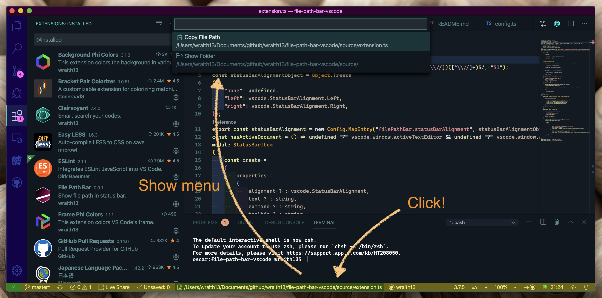

# File Path Bar README

Show active file path in status bar.

## Features

- show active file path in status bar.
- show active file's menus when click status bar item.

## Tutorial

### 0. ⬇️ Install File Path Bar

Show extension side bar within VS Code(Mac:<kbd>Command</kbd>+<kbd>Shift</kbd>+<kbd>X</kbd>, Windows and Linux: <kbd>Ctrl</kbd>+<kbd>Shift</kbd>+<kbd>X</kbd>), type `file-path-bar` and press <kbd>Enter</kbd> and click <kbd>Install</kbd>. Restart VS Code when installation is completed.

### 1. 👀 Active file path in status bar.

The active file path is automatically displayed in status bar. Click to copy the path or browse to the folder where the file is stored.

### 2. 🔧 Next step

You can change [settings](#extension-settings) by `settings.json`. And you can apply [keyboard shortcuts](#keyboard-shortcut-settings) by `keybindings.json`.

Enjoy!

## Commands

* `File Path Bar: Show Menu ...` : Show File Path Bar menu.

## Extension Settings

This extension contributes the following settings by [`settings.json`](https://code.visualstudio.com/docs/customization/userandworkspace#_creating-user-and-workspace-settings)( Mac: <kbd>Command</kbd>+<kbd>,</kbd>, Windows / Linux: <kbd>File</kbd> -> <kbd>Preferences</kbd> -> <kbd>User Settings</kbd> ):

* `filePathBar.statusBarAlignment`: Alignment on status bar. Requires a restart to take effect.

## Keyboard shortcut Settings

In default, filePathBar's commands doesn't apply keyboard shortcuts. Althogh,
you can apply keyboard shortcuts by [`keybindings.json`](https://code.visualstudio.com/docs/customization/keybindings#_customizing-shortcuts)
( Mac: <kbd>Code</kbd> -> <kbd>Preferences</kbd> -> <kbd>Keyboard Shortcuts</kbd>, Windows / Linux: <kbd>File</kbd> -> <kbd>Preferences</kbd> -> <kbd>Keyboard Shortcuts</kbd>).

Command name on `keybindings.json` is diffarent from on Command Pallete. See below table.

|on Command Pallete|on keybindings.json|
|-|-|
|`File Path Bar: Show Menu ...`|`filePathBar.menu`|

## Release Notes

see ChangLog on [marketplace](https://marketplace.visualstudio.com/items/wraith13.file-path-bar/changelog) or [github](https://github.com/wraith13/file-path-bar-vscode/blob/master/CHANGELOG.md)

## Support

[GitHub Issues](https://github.com/wraith13/file-path-bar-vscode/issues)

## License

[Boost Software License](https://github.com/wraith13/file-path-bar-vscode/blob/master/LICENSE_1_0.txt)

## Download VSIX file ( for VS Code compatible softwares )

[Releases · wraith13/file-path-bar-vscode](https://github.com/wraith13/file-path-bar-vscode/releases)

## Other extensions of wraith13's work

|Icon|Name|Description|
|---|---|---|
| |[Background Phi Colors](https://marketplace.visualstudio.com/items?itemName=wraith13.background-phi-colors)|This extension colors the background in various ways.|
| |[Zoom Bar](https://marketplace.visualstudio.com/items?itemName=wraith13.zoombar-vscode)|Zoom UI in status bar for VS Code.|
| |[Blitz](https://marketplace.visualstudio.com/items?itemName=wraith13.blitz)|Provide a quick and comfortable way to change settings by quick pick based UI.|

See all wraith13's  expansions: <https://marketplace.visualstudio.com/publishers/wraith13>
